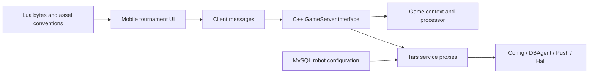

# Texas Hold’em Tournament Source Code | C++ Game Server and Mobile UI

[简体中文](README.zh-CN.md) · [繁體中文](README.zh-TW.md) · [English](README.en.md) · [Documentation site](https://alibabama401.github.io/Texas-Hold-em-Tournament-Source-Code/en/)


This repository publishes a verifiable **Texas Hold’em tournament source code** reference: C++ game messaging, Tars service proxies, MySQL robot configuration, Lua resources, SQL, API/deployment documentation, and real mobile tournament screenshots. It supports architecture review and pre-development scope assessment.

> **Scope:** The public files are not a complete, independently buildable application. Some protocol headers, build configuration, the full Unity client, and several services referenced by the deployment guide are absent. This README separates committed evidence from unverified product claims.

## Product features and tournament flow

| Area | Visible feature or flow | Repository evidence |
|---|---|---|
| Event discovery | Home, online events, live events, and training event entry points | `002.jpg`, `003.PNG`, `006.PNG` |
| Registration | Capacity, status, deadline, start countdown, and cancellation | `001.jpg`, `002.jpg` |
| Content | Rankings, tutorials, event news, hand highlights, and video categories | `003.PNG`, `004.PNG` |
| Account | Profile, address, contact, security-code, verification, cache, and account controls | `005.JPG` |
| Redemption and review | Redemption information, saved hands, and preflop/postflop actions | `008.jpg`, `009.jpg` |

A visible user journey is: discover an event → inspect reward, capacity, and timing → register and enter the waiting table → follow the start countdown → review or save hand records. Blind progression, table balancing, elimination, and settlement require validation in the complete project.

## Product screenshots

| Tournament table registration and countdown | Online tournament list, registration state and start time | Tournament home, rankings, tutorials and news |
|---|---|---|
|  |  |  |
| Tournament video, hand highlights and tutorial categories | Training tournament list, rewards, capacity and deadlines | Favorite hand history and action record |
|  |  |  |

## Technical architecture



| File or directory | Verifiable role |
|---|---|
| `gameserver.cpp/.h` | External message entry, protocol-version checks, player/table/spectator sends |
| `gameroot.cpp/.h` | Root object for configuration, plugins, context, processor, and communication |
| `Processor.cpp` | Tars request handling and asynchronous entry points |
| `OuterFactoryImp.cpp` | Config, DBAgent, Push, and Hall service proxies |
| `DBOperator.cpp/.h` | MySQL initialization and robot/recharge configuration loading |
| `robot.sql` | `robot_config` schema and sample data |
| `*.lua.bytes` | UI, scene, object, pinyin, and dictionary Lua resources |
| `docs/api_documentation.md` | Login, room, table, tournament, and admin message examples |
| `docs/deployment_guide.md` | Environment and deployment template; missing components need separate validation |

## Repository evaluation path

1. Review screenshots and the feature table to confirm the intended product shape.
2. Read `gameserver.cpp`, `gameroot.cpp`, `Processor.cpp`, and `OuterFactoryImp.cpp` to map service interaction.
3. Compare `DBOperator.cpp` with `robot.sql` to inspect fields and configuration loading.
4. Treat `docs/api_documentation.md` as an interface specification and verify each implementation in the complete project.
5. Inventory missing headers, protocols, runtime configuration, build files, Unity assets, and third-party dependencies before attempting a build.

## Clone

```bash
git clone https://github.com/alibabama401/Texas-Hold-em-Tournament-Source-Code.git
cd Texas-Hold-em-Tournament-Source-Code
```

The current repository does not expose a build entry point that can be validated, so it intentionally avoids a misleading one-command setup.

## FAQ

### Is this a complete runnable tournament application?

No. The public repository is a source and product reference. Independent builds require missing dependencies, protocol definitions, build configuration, runtime configuration, and client project files.

### Does it contain SNG or MTT support?

Screenshots show training events, a fast-cycle event, and online event lists. The API document includes tournament-list and registration examples. The complete SNG/MTT state machine, balancing, and settlement implementation is not present in the public files.

### Are Unity, Java, Redis, and iOS release readiness proven?

They appear in deployment or Word documents, but the corresponding complete projects are absent. Validate them in the full delivery before making build, production, or App Store claims.

### Is the license clear?

The repository includes an MIT `LICENSE` and a `License.md` with separate commercial wording and a different copyright name. The owner should publish one consistent license and separately confirm rights to product branding and event media.

## Contact and links

- GitHub: [alibabama401/Texas-Hold-em-Tournament-Source-Code](https://github.com/alibabama401/Texas-Hold-em-Tournament-Source-Code)
- API documentation: [docs/api_documentation.md](docs/api_documentation.md)
- Deployment notes: [docs/deployment_guide.md](docs/deployment_guide.md)
- Telegram: [@alibabama401](https://t.me/alibabama401)

If this repository helps your technical evaluation, support it with a Star, an Issue, or a reproducible improvement.