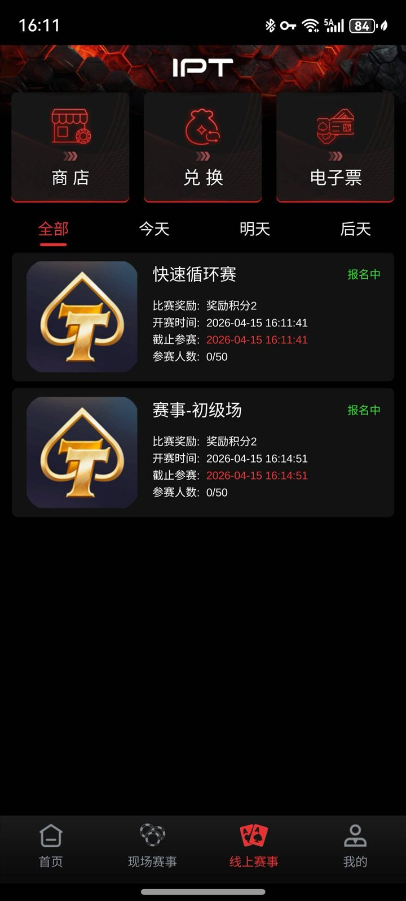
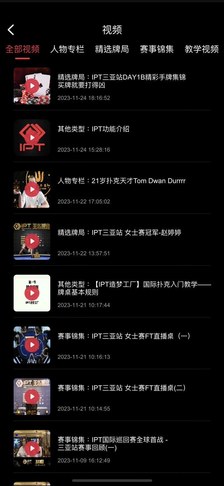
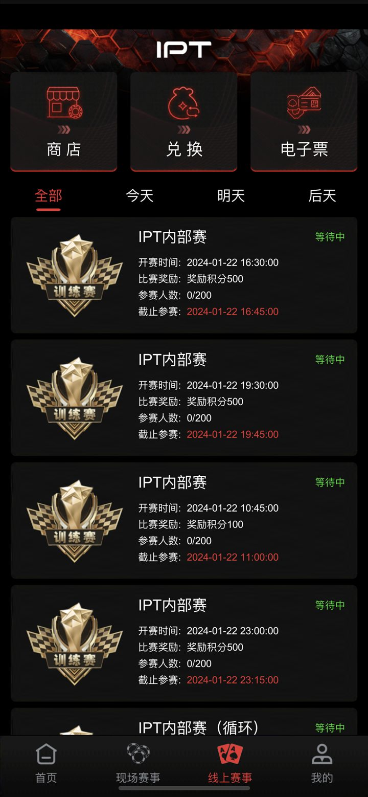
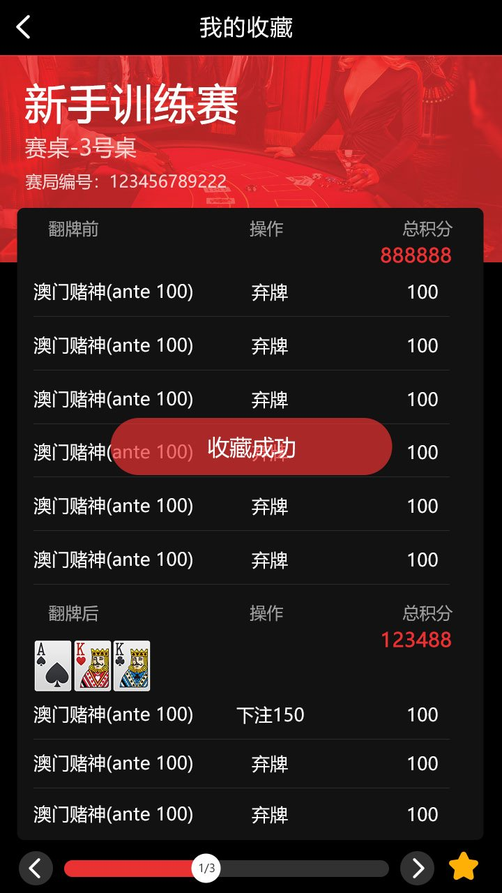
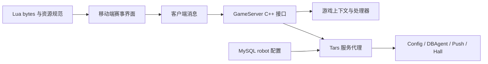

# 德州扑克锦标赛源码｜C++ 游戏服务、Tars、MySQL 与赛事移动端界面

[简体中文](README.zh-CN.md) · [繁體中文](README.zh-TW.md) · [English](README.en.md) · [产品文档站](https://alibabama401.github.io/Texas-Hold-em-Tournament-Source-Code/)


本仓库公开一组可核对的 **Texas Hold’em tournament source code** 资料：C++ 游戏通信接口、Tars 服务代理、MySQL 机器人配置、Lua 资源、SQL、API/部署文档和移动端赛事截图。适合进行赛事平台结构研究、技术评估和二次开发前的范围核对。

> **范围说明：** 当前公开文件不是可独立构建的完整工程。仓库缺少部分协议头文件、构建配置、完整 Unity 客户端及部署文档引用的若干服务。README 只描述能由已提交文件或截图证明的内容。

## 产品功能与赛事玩法

| 领域 | 可见功能或流程 | 仓库证据 |
|---|---|---|
| 赛事发现 | 首页、线上赛事、现场赛事、训练赛入口 | `docs/Assets/Screenshots/002.jpg`、`003.PNG`、`006.PNG` |
| 报名候场 | 人数、状态、截止时间、开赛倒计时、取消报名 | `001.jpg`、`002.jpg` |
| 内容中心 | 排行榜、教学、赛事资讯、精选牌局和视频分类 | `003.PNG`、`004.PNG` |
| 用户与安全 | 个人资料、地址、联系方式、安全码、实名入口、缓存与注销 | `005.JPG` |
| 兑换与复盘 | 兑换说明、收藏牌局、翻牌前后行动记录 | `008.jpg`、`009.jpg` |

典型页面流程是：发现赛事 → 查看奖励、人数与时间 → 报名并进入候场牌桌 → 等待倒计时开赛 → 查看或收藏牌局记录。具体盲注推进、桌间平衡、淘汰与结算实现需要在完整工程中验证。

## 产品截图

| 赛事牌桌报名与开赛倒计时 | 线上赛事列表、报名状态与开赛时间 | 赛事首页、排行榜、教学与资讯入口 |
|---|---|---|
|  |  |  |
| 赛事视频、牌局精选与教学分类 | 训练赛列表、奖励、人数与截止时间 | 收藏牌局与行动记录 |
|  |  |  |

## 技术组成



| 文件或目录 | 可核对的技术内容 |
|---|---|
| `gameserver.cpp/.h` | 外部消息入口、协议版本检查、单人/全桌/旁观者发送接口 |
| `gameroot.cpp/.h` | 配置、插件、上下文、处理器和通信句柄根对象 |
| `Processor.cpp` | Tars 请求处理与异步入口 |
| `OuterFactoryImp.cpp` | Config、DBAgent、Push、Hall 服务代理 |
| `DBOperator.cpp/.h` | MySQL 初始化、机器人与补充金币配置读取 |
| `robot.sql` | robot_config 表结构和示例数据 |
| `*.lua.bytes` | 界面、场景、对象、拼音与字典相关 Lua 资源 |
| `docs/api_documentation.md` | 登录、房间、牌桌、赛事及管理消息示例 |
| `docs/deployment_guide.md` | 环境与部署模板；其中缺失组件需以完整工程复核 |

## 如何阅读与评估

1. 先看截图和上方功能表，确认产品形态是否符合目标。
2. 阅读 `gameserver.cpp`、`gameroot.cpp`、`Processor.cpp` 和 `OuterFactoryImp.cpp`，建立服务调用关系。
3. 对照 `DBOperator.cpp` 与 `robot.sql` 检查数据库字段和配置加载。
4. 把 `docs/api_documentation.md` 视为接口说明样例，并逐条确认对应实现是否在完整工程中存在。
5. 构建前列出缺失头文件、协议、配置、CMake/Unity 工程和第三方依赖。

## 克隆仓库

```bash
git clone https://github.com/alibabama401/Texas-Hold-em-Tournament-Source-Code.git
cd Texas-Hold-em-Tournament-Source-Code
```

当前仓库没有足以验证的统一构建入口，因此不提供会误导使用者的“一键运行”命令。

## 常见问题

### 这是完整可运行的锦标赛项目吗？

不是。公开目录更适合作为源码与产品资料样本，独立构建仍需补齐依赖、协议、配置和客户端工程。

### 是否包含 SNG/MTT？

截图展示训练赛、快速循环赛和线上赛事列表；API 文档包含赛事列表与报名示例。SNG/MTT 的完整状态机、合桌和结算实现未在公开文件中完整呈现。

### 能否证明 Unity、Java、Redis 和 iOS 上线能力？

这些内容出现在部署或 Word 文档中，但公开仓库没有相应完整工程，需在完整交付物中验证。不能仅据文档宣称已可上线或通过审核。

### 许可是否清晰？

仓库同时存在 MIT `LICENSE` 与包含额外商用说明的 `License.md`，版权名称也不完全一致。仓库所有者应先统一许可文件；使用截图中的品牌和赛事素材前还需单独确认权利。

## 联系与相关链接

- GitHub: [alibabama401/Texas-Hold-em-Tournament-Source-Code](https://github.com/alibabama401/Texas-Hold-em-Tournament-Source-Code)
- API 文档: [docs/api_documentation.md](docs/api_documentation.md)
- 部署说明: [docs/deployment_guide.md](docs/deployment_guide.md)
- Telegram: [@alibabama401](https://t.me/alibabama401)

如果本仓库对你的技术评估有帮助，可以通过 Star、Issue 和可复现的改进提交支持项目。