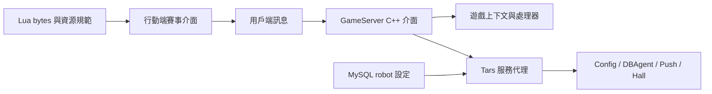

# 德州撲克錦標賽原始碼｜C++ 遊戲服務、Tars、MySQL 與賽事行動介面

[簡體中文](README.zh-CN.md) · [繁體中文](README.zh-TW.md) · [English](README.en.md) · [產品文件站](https://alibabama401.github.io/Texas-Hold-em-Tournament-Source-Code/zh-tw/)


本儲存庫公開一組可核對的 **Texas Hold’em tournament source code** 資料：C++ 遊戲通訊介面、Tars 服務代理、MySQL 機器人設定、Lua 資源、SQL、API/部署文件與行動端賽事截圖。適合用於賽事平台架構研究、技術評估和二次開發前的範圍核對。

> **範圍說明：** 目前公開檔案並非可獨立建置的完整工程。儲存庫缺少部分協定標頭檔、建置設定、完整 Unity 用戶端，以及部署文件引用的若干服務。本 README 只描述已提交檔案或截圖能證明的內容。

## 產品功能與賽事玩法

| 領域 | 可見功能或流程 | 儲存庫證據 |
|---|---|---|
| 賽事探索 | 首頁、線上賽事、現場賽事與訓練賽入口 | `docs/Assets/Screenshots/002.jpg`、`003.PNG`、`006.PNG` |
| 報名候場 | 人數、狀態、截止時間、開賽倒數與取消報名 | `001.jpg`、`002.jpg` |
| 內容中心 | 排行榜、教學、賽事資訊、精選牌局和影片分類 | `003.PNG`、`004.PNG` |
| 使用者與安全 | 個人資料、地址、聯絡方式、安全碼、實名入口、快取與帳號註銷 | `005.JPG` |
| 兌換與複盤 | 兌換說明、收藏牌局、翻牌前後行動紀錄 | `008.jpg`、`009.jpg` |

畫面呈現的典型流程是：探索賽事 → 查看獎勵、人數與時間 → 報名並進入候場牌桌 → 等待倒數開賽 → 查看或收藏牌局紀錄。盲注推進、桌間平衡、淘汰與結算的完整實作仍需在完整工程中驗證。

## 產品截圖

| 賽事牌桌報名與開賽倒數 | 線上賽事列表、報名狀態與開賽時間 | 賽事首頁、排行榜、教學與資訊入口 |
|---|---|---|
|  |  |  |
| 賽事影片、牌局精選與教學分類 | 訓練賽列表、獎勵、人數與截止時間 | 收藏牌局與行動紀錄 |
|  |  |  |

## 技術組成



| 檔案或目錄 | 可核對的技術內容 |
|---|---|
| `gameserver.cpp/.h` | 外部訊息入口、協定版本檢查、單人/全桌/旁觀者發送介面 |
| `gameroot.cpp/.h` | 設定、外掛、上下文、處理器與通訊控制代碼根物件 |
| `Processor.cpp` | Tars 請求處理與非同步入口 |
| `OuterFactoryImp.cpp` | Config、DBAgent、Push、Hall 服務代理 |
| `DBOperator.cpp/.h` | MySQL 初始化、機器人與補充金幣設定讀取 |
| `robot.sql` | `robot_config` 資料表結構與範例資料 |
| `*.lua.bytes` | 介面、場景、物件、拼音與字典相關 Lua 資源 |
| `docs/api_documentation.md` | 登入、房間、牌桌、賽事及管理訊息範例 |
| `docs/deployment_guide.md` | 環境與部署範本；其中缺少的元件需以完整工程複核 |

## 閱讀與評估方式

1. 先看截圖與功能表，確認產品形態是否符合目標。
2. 閱讀 `gameserver.cpp`、`gameroot.cpp`、`Processor.cpp` 和 `OuterFactoryImp.cpp`，建立服務呼叫關係。
3. 對照 `DBOperator.cpp` 與 `robot.sql`，檢查資料庫欄位和設定載入。
4. 將 `docs/api_documentation.md` 視為介面規格範例，逐條確認完整工程是否有對應實作。
5. 建置前列出缺少的標頭檔、協定、設定、CMake/Unity 工程和第三方相依項目。

## 複製儲存庫

```bash
git clone https://github.com/alibabama401/Texas-Hold-em-Tournament-Source-Code.git
cd Texas-Hold-em-Tournament-Source-Code
```

目前儲存庫沒有足以驗證的統一建置入口，因此不提供可能誤導使用者的「一鍵執行」命令。

## 常見問題

### 這是完整可執行的錦標賽專案嗎？

不是。公開目錄較適合作為原始碼與產品資料樣本；獨立建置仍需補齊相依項目、協定、設定和用戶端工程。

### 是否包含 SNG/MTT？

截圖顯示訓練賽、快速循環賽和線上賽事列表；API 文件包含賽事列表與報名範例。SNG/MTT 的完整狀態機、合桌和結算實作沒有在公開檔案中完整呈現。

### 能否證明 Unity、Java、Redis 和 iOS 上線能力？

這些內容出現在部署或 Word 文件，但公開儲存庫沒有對應的完整工程。必須在完整交付物中驗證，不能只依據文件宣稱已可上線或通過審核。

### 授權是否清楚？

儲存庫同時存在 MIT `LICENSE` 與含有額外商用說明的 `License.md`，而且版權名稱不完全一致。儲存庫所有者應先統一授權文件；使用截圖中的品牌和賽事素材前，也應另外確認相關權利。

## 聯絡與相關連結

- GitHub：[alibabama401/Texas-Hold-em-Tournament-Source-Code](https://github.com/alibabama401/Texas-Hold-em-Tournament-Source-Code)
- API 文件：[docs/api_documentation.md](docs/api_documentation.md)
- 部署說明：[docs/deployment_guide.md](docs/deployment_guide.md)
- Telegram：[@alibabama401](https://t.me/alibabama401)

如果本儲存庫有助於你的技術評估，可以透過 Star、Issue 或可重現的改進提交支持專案。
